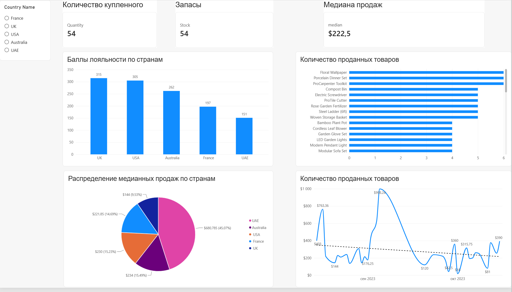
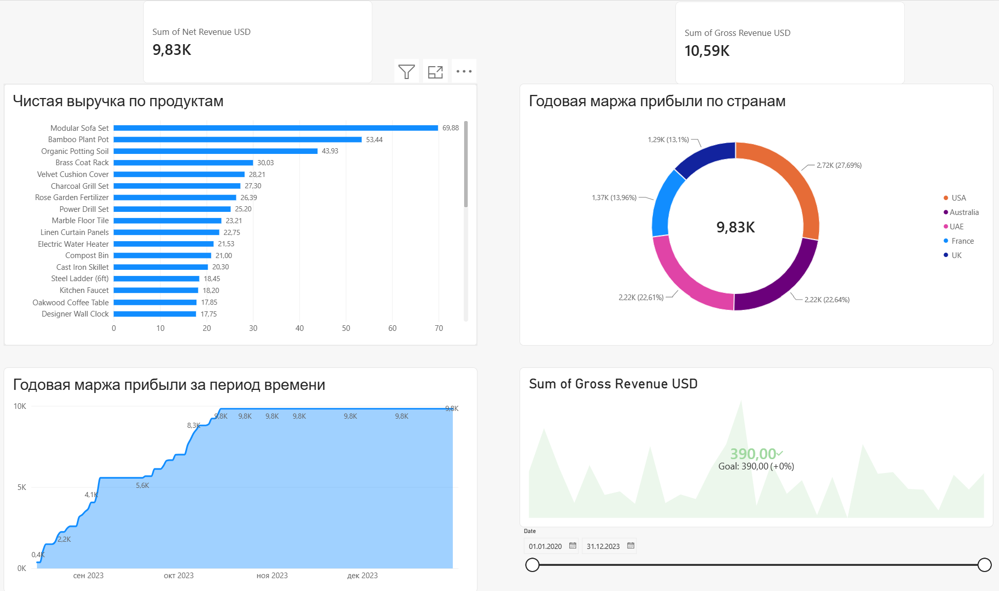

# Аналіз продажів та маржинальності продукції (Sales & Financial Dashboard)

## 📌 Опис проєкту
Аналітичний проєкт орієнтований на дослідження ефективності продажів, географічного розподілу виручки, маржинальності продуктів та балів лояльності клієнтів за період 2020–2023 років.

---

## 🛠 Використані технології та інструменти
* **MS Excel**: Первинне очищення, розрахунки за допомогою формул.
* **Power BI & Power Query**: Завантаження, трансформація та моделювання даних.
* **DAX**: Створення обчислювальних таблиць, календарів, мірок (медіана, YoY доходів, сумарні продажі).
* **Python (Pandas)**: Інтеграція скрипту в Power BI для збагачення даних курсами валют.

---

## ⚙️ Етапи реалізації

### 1. Підготовка та ETL (Power Query & Excel)
* Первинне структурування даних у MS Excel.
* Завантаження даних у Power BI та перевірка типів даних.
* Очищення даних від порожніх рядків та аномалій.
* Фільтрація записів (виключення повернених товарів).
* Збагачення даних: використання Python-скрипту (Pandas) для додавання поточних курсів валют.

### 2. Моделювання даних та розрахунки (DAX)
* Налаштування зв'язків між таблицями (модель даних).
* Створення автоматичної таблиці дат (Date Table) за допомогою DAX.
* Формування розрахункових таблиць для конвертації цін у єдину валюту.
* Написання DAX-мірок:
  * Медіана продажів.
  * Чиста та валова выручка (Net/Gross Revenue).
  * Динаміка доходу порівняно з минулим періодом (YoY).
  * Загальна кількість та обсяги продажів.

### 3. Візуалізація та Дашборди

#### 📊 Дашборд 1: Операційний аналіз продажів

* **KPI-картки**: Загальна кількість проданних товарів, сума продажів, медіанний чек.
* **Аналіз за країнами**:
  * Кругова та стовпчаста діаграми: розподіл медіанних продажів та рівень лояльності клієнтів.
  * Фільтрація (слайсер) за країнами.
* **Динаміка та асортимент**:
  * Лінійний графік продажів у часі.
  * Гістограма топових продуктів за обсягами реалізації.

#### 📈 Дашборд 2: Фінансовий аналіз та Маржинальність

* **KPI-картки**: Чистий та валовий дохід (Net & Gross Revenue).
* **Аналіз маржинальності**:
  * Лінійний графік динаміки маржинальності з часом.
  * Кольцевая (пончикова) діаграма маржинальності за країнами.
* **Ефективність продуктів та цілі**:
  * Гістограма найбільш прибуткових товарів за чистою виручкою.
  * KPI-візуалізація для відстеження виконання планових показників (Goal tracking).
  * Часовий слайсер (календар) для вибору довільного періоду.
